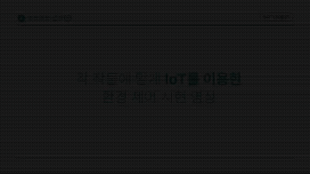
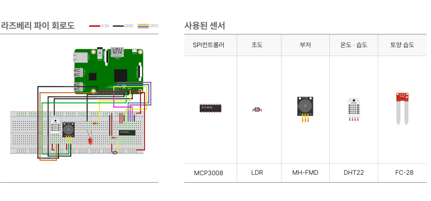
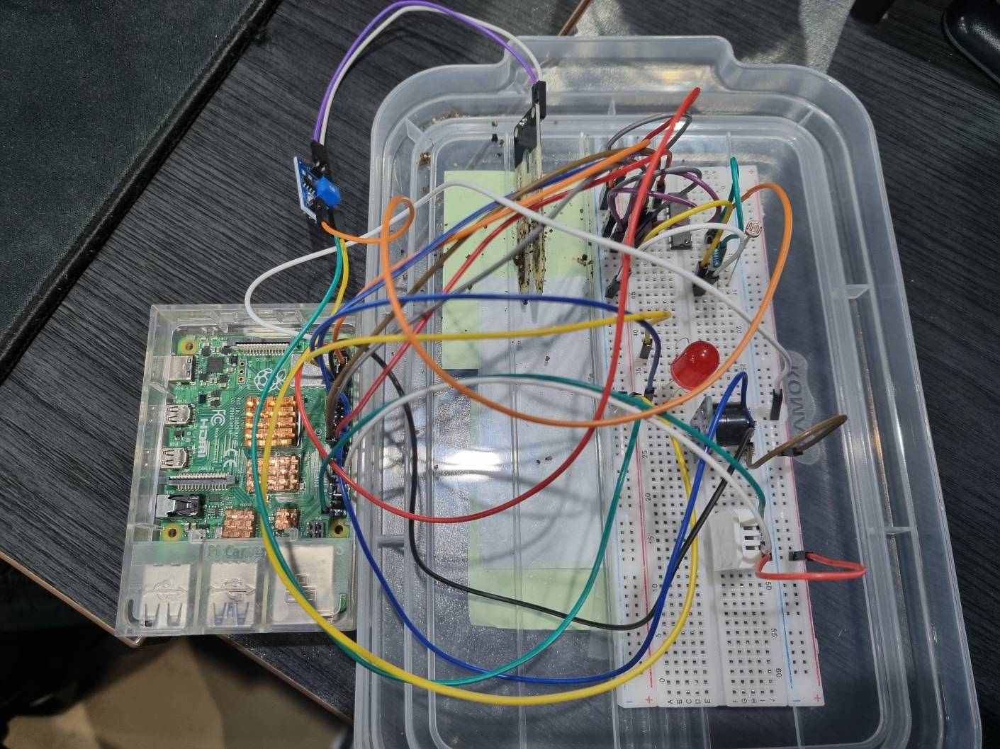

# 🌱 스마트팜 IoT 기기 개발 및 자동 제어 알고리즘 구축

- **기간**: 2025.03.21 ~ 2025.04.07  
- **유형**: 팀 프로젝트 (Team Project)

---

## 📌 프로젝트 개요

라즈베리파이와 환경 센서를 활용하여 농작물 재배에 최적화된 스마트팜 시스템을 개발했습니다.  
센서로 수집한 데이터를 기반으로 작물별 적정 환경 조건과 비교하여 LED 및 부저를 자동으로 제어합니다.

---

## 🎬 시연 영상

> 📌 위 GIF는 실제 환경 조건에 따라 LED와 부저가 자동 작동하는 모습을 보여줍니다.

---

## 🖼 회로도 및 실제 구현 사진

### 🔌 회로도

### 🧪 실제 구현 사진

---

## 🛠 사용 기술 및 장비

- **하드웨어**:  
  - Raspberry Pi  
  - LDR 조도 센서  
  - DHT-22 온습도 센서  
  - FC-28 토양 수분 센서  
  - LED  
  - 부저  

- **소프트웨어**:  
  - Python  
  - Maria DB  

---

## ⚙️ 주요 기능

- 실시간 환경 데이터 수집 (조도, 온도, 습도, 토양 수분)
- 작물별 기준값과 비교 분석
- 환경 조건 미달 시 LED 및 부저 자동 작동
- 수집 데이터 저장 및 관리 (DB 연동)

---

## 👨‍💻 담당 업무

- IoT 기기 연동을 위한 **데이터베이스 설계 및 제작**
- 센서를 라즈베리파이에 연결하여 **Python으로 환경 데이터 수집**
- 수집된 데이터를 기반으로 **LED 및 부저 자동 제어 로직 구현**
